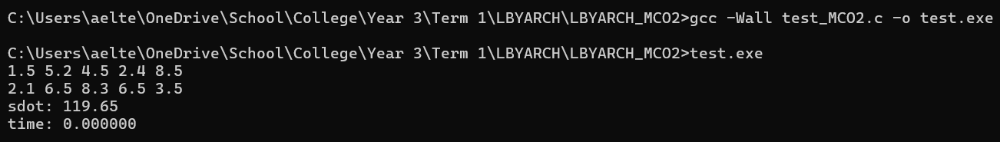
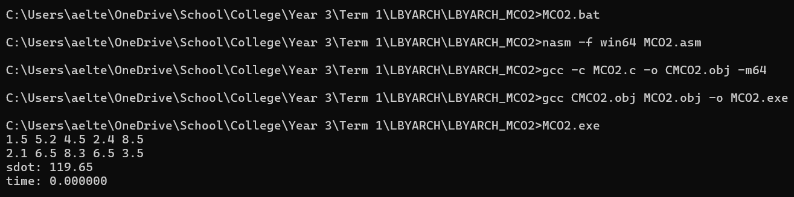
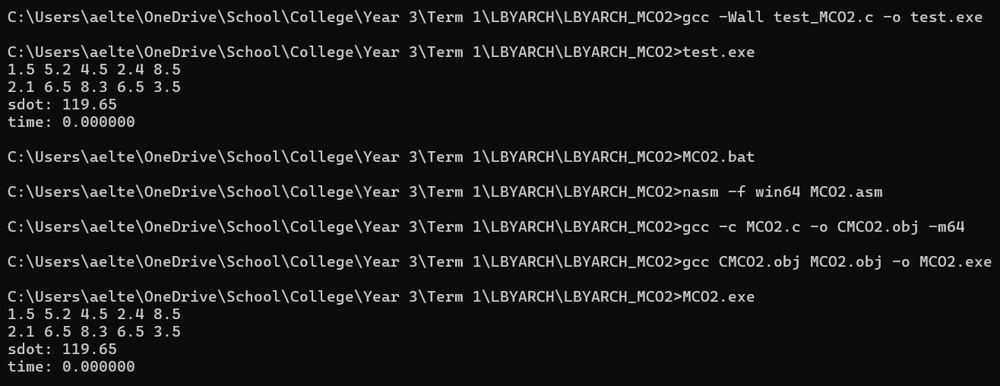

# LBYARCH_MCO2
LBYARCH MCO2

Google Drive Folder for Vector Elements:
https://drive.google.com/drive/folders/1ka8_ms5F_SCvAwsTGNa2eAoQQ79deU-4?usp=sharing

Screenshot of the Result After Running the C Reference Program:

Screenshot of the Result After Running the Kernel:

Screenshot of the Results of the C Reference Program and the Kernel Program:

Average Execution Time For Reference Program: 0.000000 seconds 
Average EXecution Time For Kernel Program: 0.000000 seconds 
 

Analysis:  
After getting the average execution time of each vector, it can be said that the length of the vector and the average execution time are dependent of each other. As the length of each vector increases, the execution time also increases. This is because a vector with a larger size increases the size of the memory needed to be allocated for the read and write operations, resulting in longer execution times.